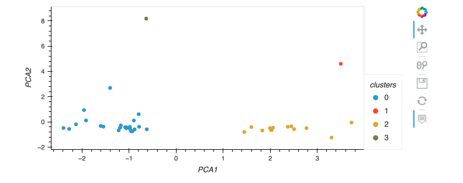

# Crypto_clustering

This application clusters cryptocurrencies by their performance in different time periods. We’ll then plot the results so that we can visually display the performance.


### Prepare the Data

This section prepares the data before running the K-Means algorithm. 

### Best Value for k Using the Original Data

In this section, we will use the elbow method to find the best value for `k`.

### Cluster Cryptocurrencies with K-means Using the Original Data

In this section, we will use the K-Means algorithm with the best value for `k` found in the previous section to cluster the cryptocurrencies according to the price changes of cryptocurrencies provided.


### Best Value for k Using the PCA Data

In this section, we will use the elbow method to find the best value for `k` using the PCA data.

### Cluster Cryptocurrencies with K-means Using the PCA Data

In this section, we will use the PCA data and the K-Means algorithm with the best value for `k` found in the previous section to cluster the cryptocurrencies according to the principal components.





### Visualize and Compare the Results

In this section, we will visually analyze the cluster analysis results by contrasting the outcome with and without using the optimization techniques.


## Tecnologies required and installation guide:

* **hvPlot**

``` conda install -c pyviz hvplot ```

* **scikit-learn**

``` pip install -U scikit-learn ```

## Instructions

Use the `crypto_investments.ipynb` notebook to clusters cryptocurrencies by their performance and display with hvPlot.

Note that this application requires the use of hvPlot for the visualizations.

## Contributors

Jaime Aranda


---

## License

Licensed under the MIT License.
